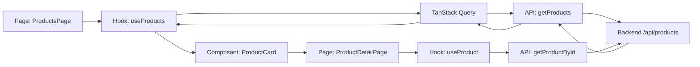

# 🛒 iit-store-front — Le projet expliqué simplement

Bienvenue ! Ce document explique le projet **iit-store-front** avec des mots simples, comme si on parlait à un enfant de 10 ans. 🎈

---

## 🏠 C'est quoi ce projet ?

C'est une **boutique en ligne** (comme une boutique de jouets sur internet). Le dossier `src` (qui veut dire "source") contient **toutes les pièces** pour construire cette boutique.

---

## 🧩 Les 4 grandes boîtes du dossier `src`

Le dossier `src` est comme une **boîte à outils** avec plusieurs tiroirs :

```
src/
├── app/          ← Le chef d'orchestre 🎼
├── components/   ← Les briques de Lego 🧱
├── features/     ← Les rayons du magasin 🛒
├── pages/        ← Les écrans qu'on voit 🖥️
└── types/        ← Les fiches de description 📋
```

---

## 🎼 `app/` — Le chef d'orchestre

C'est lui qui **décide quoi montrer**. Le fichier le plus important est `router.tsx`.

> **À retenir** : le routeur, c'est comme une **carte routière**. Il dit : "Si tu vas sur `/products`, montre la page des produits. Si tu vas sur `/products/5`, montre le produit numéro 5."

Il y a aussi `providers.tsx` qui donne des **super-pouvoirs** à toute la boutique (la gestion des données).

---

## 🧱 `components/` — Les briques de Lego

Ce sont des **petites pièces réutilisables**. Comme des Lego, tu les assembles pour faire une grande maison.

Ici on a le **layout** (la mise en page) :
- `Header` = le **chapeau** de la page (le menu en haut)
- `Footer` = les **chaussures** (le menu en bas)
- `MainLayout` = le **corps** qui assemble le tout

> **À retenir** : un composant, c'est une **pièce de Lego**. Tu la fabriques une fois, et tu la réutilises partout.

---

## 🛒 `features/` — Les rayons du magasin

C'est le **cœur du projet** ! Chaque "feature" (fonctionnalité) est un **rayon du magasin** :

- `products/` = le rayon **produits** (les jouets)
- `auth/` = le rayon **connexion** (pour se connecter, encore vide)

Dans le rayon `products`, il y a 3 sous-boîtes :
- `api/` → **le téléphone** 📞 : il appelle le serveur pour demander les produits
- `hooks/` → **le cerveau** 🧠 : il gère "je charge...", "j'ai les données", "erreur !"
- `components/` → **la vitrine** 🪟 : `ProductCard`, la petite carte qui montre un jouet

> **À retenir** : une feature, c'est un **rayon complet** du magasin. Tout ce qui concerne les produits est dans `products/`.

---

## 🖥️ `pages/` — Les écrans qu'on voit

Chaque page = **un écran** que l'utilisateur regarde :
- `HomePage` = la **porte d'entrée** (l'accueil)
- `ProductsPage` = la **liste des jouets**
- `ProductDetailPage` = **un jouet en gros plan**
- `NotFoundPage` = le **"404"** (page introuvable)

> **À retenir** : une page, c'est un **écran complet**. Elle utilise les briques (composants) et les rayons (features).

---

## 📋 `types/` — Les fiches de description

C'est comme une **fiche de renseignements** pour chaque jouet :

```
Un produit a :
- un nom
- une description
- un prix
- une image
```

> **À retenir** : un type, c'est une **fiche** qui dit "un produit, c'est fait de quoi".

---

## 🔄 Le grand voyage d'une donnée (le plus important !)

Voici comment ça marche quand tu cliques sur "Produits" :

```
1. Tu cliques → la page ProductsPage s'ouvre
2. Elle appelle le cerveau (hook useProducts)
3. Le cerveau prend le téléphone (api)
4. Le téléphone appelle le serveur : "Donne-moi les jouets !"
5. Le serveur répond : "Voilà les jouets !"
6. La page les affiche avec les cartes (ProductCard)
```

C'est comme **commander une pizza** : tu appelles (api), le restaurant prépare (serveur), et on te la livre (affichage). 🍕

---

## ✅ Ce que tu dois MAÎTRISER en priorité

Si tu ne retiens que 3 choses :

1. **Le routeur** (`app/router.tsx`) — la carte routière qui relie les URLs aux pages
2. **Les features** (`features/products/`) — le rayon complet : api + hooks + composants
3. **Le voyage des données** — page → hook → api → serveur → affichage

---

## 🚀 Commandes utiles

| Commande | À quoi ça sert |
|----------|----------------|
| `npm install` | Installe les jouets (les dépendances) |
| `npm run dev` | Allume la boutique pour la voir |
| `npm run build` | Prépare la boutique pour la vente |
| `npm run lint` | Vérifie qu'il n'y a pas d'erreurs |

---

🎉 **Bravo !** Tu connais maintenant l'essentiel du projet `iit-store-front`. Bon développement !
3. [Arborescence du projet](#3-arborescence-du-projet)
4. [Les fichiers de configuration](#4-les-fichiers-de-configuration)
5. [Le point d'entrée : `index.html` et `main.tsx`](#5-le-point-dentrée--indexhtml-et-maintsx)
6. [Le dossier `src/app`](#6-le-dossier-srcapp)
7. [Le dossier `src/components`](#7-le-dossier-srccomponents)
8. [Le dossier `src/features`](#8-le-dossier-srcfeatures)
9. [Le dossier `src/pages`](#9-le-dossier-srcpages)
10. [Le dossier `src/types`](#10-le-dossier-srctypes)
11. [Les dossiers `public` et `src/assets`](#11-les-dossiers-public-et-srcassets)
12. [Le flux de données de bout en bout](#12-le-flux-de-données-de-bout-en-bout)
13. [Commandes utiles](#13-commandes-utiles)
14. [Prochaines étapes](#14-prochaines-étapes)

---

## 1. Présentation du projet

**iit-store-front** est une application web de **boutique en ligne** (e-commerce) construite avec **React 19**, **TypeScript**, **Vite** et **Tailwind CSS**. C'est le **front-end** (la partie visible par l'utilisateur) d'une plateforme de vente de produits.

Le projet est organisé selon une architecture **par fonctionnalités** (feature-based) : chaque domaine métier (authentification, produits, etc.) regroupe ses propres composants, hooks, API et types dans un dossier dédié. Cette organisation rend le code **modulaire**, **maintenable** et **facile à faire évoluer**.

> ⚠️ **État actuel** : le projet est en **développement**. Certaines fonctionnalités (panier, connexion, tableau de bord) sont prévues mais **commentées** dans le routeur. Les fichiers d'authentification sont vides et prêts à être remplis.

---

## 2. Technologies utilisées

| Technologie | Rôle |
|-------------|------|
| **React 19** | Bibliothèque UI pour construire l'interface |
| **TypeScript 6** | Typage statique pour un code plus sûr |
| **Vite 8** | Serveur de développement et bundler (build) |
| **Tailwind CSS 4** | Framework CSS utilitaire pour le style |
| **React Router 7** | Gestion de la navigation entre les pages |
| **TanStack Query 5** | Gestion des requêtes API, cache et états de chargement |
| **Oxlint** | Linter (analyse statique du code) |

---

## 3. Arborescence du projet

```
iit-store-front/
├── .gitignore                  # Fichiers à ignorer par Git
├── .oxlintrc.json              # Configuration du linter Oxlint
├── index.html                  # Page HTML d'entrée
├── package.json                # Dépendances et scripts
├── package-lock.json           # Verrouillage des versions (généré)
├── tsconfig.json               # Config TypeScript racine
├── tsconfig.app.json           # Config TS pour le code applicatif
├── tsconfig.node.json          # Config TS pour les outils Node
├── vite.config.ts              # Configuration de Vite
├── public/                     # Fichiers statiques servis tels quels
│   ├── favicon.svg
│   └── icons.svg
└── src/                        # Code source de l'application
    ├── main.tsx                # Point d'entrée React
    ├── index.css               # Styles globaux (Tailwind)
    ├── app/                    # Cœur de l'application
    │   ├── App.tsx
    │   ├── App.css
    │   ├── providers.tsx       # Providers globaux (React Query)
    │   └── router.tsx          # Définition des routes
    ├── assets/                 # Images et ressources
    │   ├── hero.png
    │   ├── react.svg
    │   └── vite.svg
    ├── components/             # Composants réutilisables
    │   └── layout/
    │       ├── Header.tsx
    │       ├── Footer.tsx
    │       └── MainLayout.tsx
    ├── features/               # Fonctionnalités métier
    │   ├── auth/               # Authentification (à développer)
    │   │   ├── index.ts        # (vide)
    │   │   └── types.ts        # (vide)
    │   └── products/           # Gestion des produits
    │       ├── index.ts        # Point d'export public
    │       ├── api/
    │       │   └── getProducts.ts
    │       ├── components/
    │       │   └── ProductCard.tsx
    │       └── hooks/
    │           └── useProducts.ts
    ├── pages/                  # Pages (une par route)
    │   ├── home/
    │   │   └── HomePage.tsx
    │   ├── boutique/
    │   │   └── product/
    │   │       ├── ProductsPage.tsx
    │   │       └── ProductDetailPage.tsx
    │   └── not-found/
    │       └── NotFoundPage.tsx
    └── types/                  # Types TypeScript partagés
        └── product.ts
```

---

## 4. Les fichiers de configuration

### 4.1 `package.json`

C'est le **cœur du projet Node.js**. Il déclare le nom, les scripts et toutes les dépendances.

```json
{
  "name": "iit-store-front",
  "private": true,
  "version": "0.0.0",
  "type": "module",
  "scripts": {
    "dev": "vite",
    "build": "tsc -b && vite build",
    "lint": "oxlint",
    "preview": "vite preview"
  },
  ...
}
```

**Explication des scripts :**

| Script | Commande | Rôle |
|--------|----------|------|
| `dev` | `vite` | Lance le serveur de développement avec rechargement à chaud (HMR) |
| `build` | `tsc -b && vite build` | Vérifie les types TypeScript puis compile l'app pour la production |
| `lint` | `oxlint` | Analyse le code pour détecter les erreurs et mauvaises pratiques |
| `preview` | `vite preview` | Prévisualise le build de production en local |

**Dépendances principales :**

- **`dependencies`** (utilisées en production) :
  - `@tailwindcss/vite` — plugin Tailwind pour Vite
  - `@tanstack/react-query` — gestion des requêtes API
  - `react` / `react-dom` — la bibliothèque React
  - `react-router-dom` — la navigation
  - `tailwindcss` — le framework CSS

- **`devDependencies`** (utilisées uniquement en développement) :
  - `@types/node`, `@types/react`, `@types/react-dom` — types TypeScript
  - `@vitejs/plugin-react` — support de React dans Vite
  - `oxlint` — le linter
  - `typescript` — le compilateur TypeScript
  - `vite` — le bundler

### 4.2 `vite.config.ts`

Configure **Vite**. On y ajoute le plugin React, le plugin Tailwind et un **alias** `@` qui pointe vers le dossier `src`.

```ts
import { defineConfig } from 'vite'
import react from '@vitejs/plugin-react'
import tailwindcss from '@tailwindcss/vite'
import path from 'path'

export default defineConfig({
  plugins: [react(), tailwindcss()],
  resolve: {
    alias: {
      '@': path.resolve(__dirname, './src'),
    },
  },
})
```

> 💡 **L'alias `@`** permet d'écrire `import { ProductCard } from '@/features/products'` au lieu de chemins relatifs longs comme `../../features/products`. C'est plus propre et plus lisible.

### 4.3 `tsconfig.json`

Fichier **racine** TypeScript. Il ne compile rien lui-même (`files: []`) mais **référence** deux sous-configurations :

```json
{
  "files": [],
  "references": [
    { "path": "./tsconfig.app.json" },
    { "path": "./tsconfig.node.json" }
  ]
}
```

Cette séparation permet de compiler séparément le **code applicatif** (React) et les **outils Node** (comme `vite.config.ts`).

### 4.4 `tsconfig.app.json`

Configuration TypeScript pour le **code de l'application** (dossier `src`). Points clés :

- `target: "es2023"` — version moderne de JavaScript
- `module: "esnext"` — modules ES modernes
- `jsx: "react-jsx"` — syntaxe JSX automatique de React
- `moduleResolution: "bundler"` — résolution adaptée à Vite
- `noEmit: true` — ne génère pas de fichiers JS (Vite s'en charge)
- `noUnusedLocals` / `noUnusedParameters` — interdit les variables inutilisées
- `baseUrl` + `paths` — définit l'alias `@/*` → `src/*`

```json
{
  "compilerOptions": {
    "target": "es2023",
    "lib": ["ES2023", "DOM"],
    "module": "esnext",
    "jsx": "react-jsx",
    "moduleResolution": "bundler",
    "noEmit": true,
    "noUnusedLocals": true,
    "noUnusedParameters": true,
    "baseUrl": ".",
    "paths": { "@/*": ["src/*"] }
  },
  "include": ["src"]
}
```

### 4.5 `tsconfig.node.json`

Configuration TypeScript pour les **fichiers Node** (ici uniquement `vite.config.ts`). Elle utilise `module: "nodenext"` et les types Node.

### 4.6 `.oxlintrc.json`

Configuration du **linter Oxlint**. Il active les plugins React, TypeScript et Oxc, avec des règles spécifiques :

```json
{
  "$schema": "./node_modules/oxlint/configuration_schema.json",
  "plugins": ["react", "typescript", "oxc"],
  "rules": {
    "react/rules-of-hooks": "error",
    "react/only-export-components": ["warn", { "allowConstantExport": true }]
  }
}
```

- `react/rules-of-hooks` — vérifie que les hooks React sont bien utilisés (jamais dans des conditions ou boucles).
- `react/only-export-components` — encourage à n'exporter que des composants depuis les fichiers de composants.

### 4.7 `.gitignore`

Liste les fichiers/dossiers que **Git ne doit pas suivre** : `node_modules`, `dist`, les logs, les fichiers d'éditeur (`.vscode`, `.idea`), etc.

---

## 5. Le point d'entrée : `index.html` et `main.tsx`

### 5.1 `index.html`

C'est la **page HTML de base** servie par le navigateur. Elle contient une `<div id="root">` (où React injectera l'application) et charge le script principal.

```html
<!doctype html>
<html lang="en">
  <head>
    <meta charset="UTF-8" />
    <link rel="icon" type="image/svg+xml" href="/favicon.svg" />
    <meta name="viewport" content="width=device-width, initial-scale=1.0" />
    <title>iit-store-front</title>
  </head>
  <body>
    <div id="root"></div>
    <script type="module" src="/src/main.tsx"></script>
  </body>
</html>
```

### 5.2 `src/main.tsx`

C'est le **point d'entrée JavaScript/TypeScript** de l'application. Il monte React dans la page :

```tsx
import { StrictMode } from 'react'
import { createRoot } from 'react-dom/client'
import { RouterProvider } from 'react-router-dom'
import { router } from './app/router'
import { AppProviders } from './app/providers'
import './index.css'

createRoot(document.getElementById('root')!).render(
  <StrictMode>
    <AppProviders>
      <RouterProvider router={router} />
    </AppProviders>
  </StrictMode>,
)
```

**Explication :**

- `StrictMode` — mode strict de React (détecte les problèmes en développement).
- `AppProviders` — englobe l'app avec les providers globaux (React Query).
- `RouterProvider` — fournit le routeur à toute l'application.
- `createRoot(...).render(...)` — monte l'application dans l'élément `#root`.

### 5.3 `src/index.css`

Contient uniquement l'import de Tailwind CSS :

```css
@import "tailwindcss";
```

C'est grâce à cette ligne que toutes les classes utilitaires Tailwind (comme `flex`, `p-4`, `text-xl`) sont disponibles.

---

## 6. Le dossier `src/app`

Ce dossier contient le **cœur de l'application** : le routeur, les providers et le composant racine.

### 6.1 `src/app/router.tsx`

Définit **toutes les routes** de l'application. C'est ici qu'on déclare quelle page afficher pour quelle URL.

```tsx
import { createBrowserRouter } from 'react-router-dom'
import { lazy, Suspense, type ReactNode } from 'react'
import { MainLayout } from '@/components/layout/MainLayout'

const HomePage = lazy(() => import('@/pages/home/HomePage'))
const ProductsPage = lazy(() => import('@/pages/boutique/product/ProductsPage'))
const ProductDetailPage = lazy(() => import('@/pages/boutique/product/ProductDetailPage'))
const NotFoundPage = lazy(() => import('@/pages/not-found/NotFoundPage'))

function withSuspense(children: ReactNode) {
  return <Suspense fallback={<div className="p-8 text-center">Chargement...</div>}>{children}</Suspense>
}

export const router = createBrowserRouter([
  {
    path: '/',
    element: <MainLayout />,
    children: [
      { index: true, element: withSuspense(<HomePage />) },
      { path: 'products', element: withSuspense(<ProductsPage />) },
      { path: 'products/:id', element: withSuspense(<ProductDetailPage />) },
      { path: '*', element: withSuspense(<NotFoundPage />) },
    ],
  },
])
```

**Explication :**

- **`lazy()`** — chargement **paresseux** des pages : chaque page n'est téléchargée que lorsqu'on y accède. Cela rend l'application plus rapide au démarrage.
- **`Suspense`** — affiche un message « Chargement... » pendant que la page se charge.
- **`createBrowserRouter`** — crée le routeur basé sur l'URL du navigateur.
- **Routes définies :**
  - `/` → `HomePage` (page d'accueil, route index)
  - `/products` → `ProductsPage` (liste des produits)
  - `/products/:id` → `ProductDetailPage` (détail d'un produit, `:id` est un paramètre dynamique)
  - `*` → `NotFoundPage` (page 404 pour toute URL inconnue)

> 🔒 **Routes commentées** : panier (`/cart`), connexion (`/login`), inscription (`/register`) et tableau de bord (`/dashboard`) sont prévus mais pas encore activés. Le tableau de bord devra être protégé par un `ProtectedRoute`.

### 6.2 `src/app/providers.tsx`

Regroupe les **providers globaux**. Actuellement, il fournit **TanStack Query** à toute l'application.

```tsx
import { QueryClient, QueryClientProvider } from '@tanstack/react-query'
import type { ReactNode } from 'react'

const queryClient = new QueryClient()

export function AppProviders({ children }: { children: ReactNode }) {
  return <QueryClientProvider client={queryClient}>{children}</QueryClientProvider>
}
```

- `QueryClient` — l'instance centrale qui gère le cache des requêtes.
- `QueryClientProvider` — rend ce client accessible partout via les hooks `useQuery`.

### 6.3 `src/app/App.tsx`

Composant racine **actuellement vide** (le template Vite par défaut). Il n'est pas utilisé dans le routeur actuel, car `main.tsx` utilise directement `RouterProvider`.

```tsx
import './App.css'

function App() {
  return <></>
}

export default App
```

### 6.4 `src/app/App.css`

Contient du **CSS du template Vite par défaut** (styles pour le compteur, le hero, etc.). Il n'est **pas réellement utilisé** par l'application actuelle, qui s'appuie sur Tailwind. Il pourra être supprimé ou remplacé.

---

## 7. Le dossier `src/components`

Contient les **composants réutilisables**, organisés par catégorie. Ici, on trouve le dossier `layout` avec les composants de mise en page.

### 7.1 `src/components/layout/MainLayout.tsx`

C'est le **gabarit principal** de l'application. Il structure la page en trois zones : en-tête, contenu, pied de page.

```tsx
import { Outlet } from 'react-router-dom'
import { Header } from './Header'
import { Footer } from './Footer'

export function MainLayout() {
  return (
    <div className="flex min-h-screen flex-col">
      <Header />
      <main className="flex-1">
        <Outlet />
      </main>
      <Footer />
    </div>
  )
}
```

- `<Outlet />` — c'est le **point d'insertion** où React Router affiche la page correspondant à la route courante.
- `min-h-screen` — la page occupe au minimum toute la hauteur de l'écran.
- `flex-1` — le contenu principal s'étend pour remplir l'espace restant.

### 7.2 `src/components/layout/Header.tsx`

L'**en-tête** de la boutique, avec le logo et la navigation.

```tsx
import { Link } from 'react-router-dom'

export function Header() {
  return (
    <header className="border-b px-4 py-3">
      <nav className="container mx-auto flex items-center justify-between">
        <Link to="/" className="text-xl font-bold">iit-store</Link>
        <div className="flex gap-4">
          <Link to="/products">Produits</Link>
          <Link to="/cart">Panier</Link>
          <Link to="/login">Connexion</Link>
        </div>
      </nav>
    </header>
  )
}
```

- `<Link>` — composant de React Router pour naviguer **sans recharger la page**.
- Les liens pointent vers `/`, `/products`, `/cart` et `/login`.

### 7.3 `src/components/layout/Footer.tsx`

Le **pied de page**, identique à l'en-tête dans sa structure (logo + navigation).

```tsx
import { Link } from 'react-router-dom'

export function Footer() {
  return (
    <footer className="border-b px-4 py-3">
      <nav className="container mx-auto flex items-center justify-between">
        <Link to="/" className="text-xl font-bold">iit-store</Link>
        <div className="flex gap-4">
          <Link to="/products">Produits</Link>
          <Link to="/cart">Panier</Link>
          <Link to="/login">Connexion</Link>
        </div>
      </nav>
    </footer>
  )
}
```

> 💡 **Remarque** : `Header` et `Footer` sont presque identiques. On pourrait les factoriser en un seul composant de navigation réutilisable.

---

## 8. Le dossier `src/features`

C'est le cœur de l'**architecture par fonctionnalités**. Chaque fonctionnalité métier est isolée dans son propre dossier, avec tout ce qui la concerne : API, composants, hooks, types.

### 8.1 La fonctionnalité `products`

#### `src/features/products/index.ts`

C'est le **point d'export public** de la fonctionnalité. Il ré-exporte ce qui doit être accessible depuis l'extérieur. C'est une **barrière d'encapsulation** : le reste de l'app n'importe que depuis ce fichier, pas depuis les fichiers internes.

```ts
export { useProducts, useProduct } from './hooks/useProducts'
export { ProductCard } from './components/ProductCard'
```

#### `src/features/products/api/getProducts.ts`

Contient les **appels API** vers le backend. On utilise `fetch` pour récupérer les produits.

```ts
import type { Product } from '@/types/product'

export async function getProducts(): Promise<Product[]> {
  const res = await fetch('/api/products')
  if (!res.ok) throw new Error('Erreur lors du chargement des produits')
  return res.json()
}

export async function getProductById(id: string): Promise<Product> {
  const res = await fetch(`/api/products/${id}`)
  if (!res.ok) throw new Error('Produit introuvable')
  return res.json()
}
```

- `getProducts()` — récupère **tous** les produits depuis `/api/products`.
- `getProductById(id)` — récupère **un** produit précis depuis `/api/products/:id`.
- En cas d'erreur HTTP, on **lève une exception** avec un message clair.

> ⚠️ **Note** : les URLs `/api/products` supposent qu'un **backend** existe (ou un proxy Vite). Sans backend, ces appels échoueront.

#### `src/features/products/hooks/useProducts.ts`

Contient les **hooks React** qui utilisent TanStack Query pour gérer les états de chargement, d'erreur et de cache.

```ts
import { useQuery } from '@tanstack/react-query'
import { getProducts, getProductById } from '../api/getProducts'

export function useProducts() {
  return useQuery({ queryKey: ['products'], queryFn: getProducts })
}

export function useProduct(id: string) {
  return useQuery({
    queryKey: ['products', id],
    queryFn: () => getProductById(id),
    enabled: !!id,
  })
}
```

- `useProducts()` — retourne la liste des produits. La clé de cache est `['products']`.
- `useProduct(id)` — retourne un produit précis. La clé est `['products', id]`.
- `enabled: !!id` — la requête ne s'exécute que si un `id` est fourni.

> 💡 **TanStack Query** gère automatiquement : le chargement (`isLoading`), les erreurs (`error`), le cache et le rechargement.

#### `src/features/products/components/ProductCard.tsx`

Composant qui affiche **une carte produit** dans la grille.

```tsx
import type { Product } from '@/types/product'
import { Link } from 'react-router-dom'

export function ProductCard({ product }: { product: Product }) {
  return (
    <Link
      to={`/products/${product.id}`}
      className="block rounded-lg border p-4 transition hover:shadow-md"
    >
      
      <h3 className="font-medium">{product.name}</h3>
      <p className="text-gray-600">{product.price.toFixed(2)} €</p>
    </Link>
  )
}
```

- Reçoit un objet `product` en **prop**.
- Toute la carte est un `<Link>` vers la page de détail `/products/:id`.
- Affiche l'image, le nom et le prix (formaté avec 2 décimales et le symbole €).

### 8.2 La fonctionnalité `auth`

Le dossier `auth` est **prévu pour l'authentification** mais est encore **vide** :

- `src/features/auth/index.ts` — vide (point d'export à remplir).
- `src/features/auth/types.ts` — vide (types à définir, ex. `User`, `LoginPayload`).

C'est ici qu'on ajoutera plus tard la gestion des utilisateurs, la connexion, l'inscription, etc.

---

## 9. Le dossier `src/pages`

Contient les **pages** de l'application, une par route. Chaque page est un composant React complet.

### 9.1 `src/pages/home/HomePage.tsx`

La **page d'accueil**. Simple pour l'instant : un titre de bienvenue.

```tsx
export default function HomePage() {
  return (
    <div className="container mx-auto px-4 py-8">
      <h1 className="text-3xl font-bold">Bienvenue sur iit-store</h1>
    </div>
  )
}
```

### 9.2 `src/pages/boutique/product/ProductsPage.tsx`

La page qui affiche la **liste des produits**. Elle utilise le hook `useProducts` et le composant `ProductCard`.

```tsx
import { useProducts, ProductCard } from '@/features/products'

export default function ProductsPage() {
    const {data: products, isLoading, error} = useProducts()

    if (isLoading) return <p className="container mx-auto px-4 py-8">Chargement...</p>
    if (error) return <p className="container mx-auto px-4 py-8">Erreur de chargement</p>

    return (
        <div className="container mx-auto px-4 py-8">
            <h1 className="mb-6 text-2xl font-semibold">Nos produits</h1>
            <div className="grid grid-cols-2 gap-4 md:grid-cols-4">
                {products?.map((p) => <ProductCard key={p.id} product={p}/>)}
            </div>
        </div>
    )
}
```

**Explication :**

- `useProducts()` retourne `{ data, isLoading, error }`.
- Si `isLoading` → affiche « Chargement... ».
- Si `error` → affiche « Erreur de chargement ».
- Sinon → affiche une **grille responsive** (`grid-cols-2` sur mobile, `md:grid-cols-4` sur grand écran) de cartes produits.

### 9.3 `src/pages/boutique/product/ProductDetailPage.tsx`

La page de **détail d'un produit**. Elle lit le paramètre `:id` dans l'URL.

```tsx
import { useParams } from 'react-router-dom'
import { useProduct } from '@/features/products'

export default function ProductDetailPage() {
  const { id } = useParams<{ id: string }>()
  const { data: product, isLoading } = useProduct(id!)

  if (isLoading) return <p className="container mx-auto px-4 py-8">Chargement...</p>
  if (!product) return <p className="container mx-auto px-4 py-8">Produit introuvable</p>

  return (
    <div className="container mx-auto px-4 py-8">
      <h1 className="text-2xl font-bold">{product.name}</h1>
      <p className="mt-2 text-xl text-gray-700">{product.price.toFixed(2)} €</p>
    </div>
  )
}
```

- `useParams()` — récupère le paramètre `id` depuis l'URL `/products/:id`.
- `useProduct(id)` — charge le produit correspondant.
- Affiche le nom et le prix du produit.

### 9.4 `src/pages/not-found/NotFoundPage.tsx`

La **page 404**, affichée pour toute URL inconnue.

```tsx
import { Link } from 'react-router-dom'

export default function NotFoundPage() {
    return (
        <div className="flex flex-col items-center justify-center py-24 text-center">
            <h1 className="text-4xl font-bold">404</h1>
            <p className="mt-2 text-gray-600">Page introuvable</p>
            <Link to="/" className="mt-4 text-blue-600 underline">Retour à l'accueil</Link>
        </div>
    )
}
```

---

## 10. Le dossier `src/types`

Contient les **types TypeScript partagés** entre plusieurs fonctionnalités.

### `src/types/product.ts`

Définit la **structure d'un produit** :

```ts
export interface Product {
  id: string
  name: string
  description: string
  price: number
  imageUrl: string
}
```

Un produit a :
- `id` — identifiant unique (chaîne de caractères)
- `name` — le nom
- `description` — la description
- `price` — le prix (nombre)
- `imageUrl` — l'URL de l'image

Ce type est utilisé par l'API, les hooks, les composants et les pages.

---

## 11. Les dossiers `public` et `src/assets`

### `public/`

Contient les fichiers **statiques** servis tels quels par le serveur (sans passer par le bundler) :
- `favicon.svg` — l'icône de l'onglet du navigateur.
- `icons.svg` — un sprite d'icônes.

### `src/assets/`

Contient les **ressources importées dans le code** (elles passent par Vite) :
- `hero.png` — image d'illustration.
- `react.svg` / `vite.svg` — logos du template par défaut.

---

## 12. Le flux de données de bout en bout

Voici comment les données circulent dans l'application, de l'API jusqu'à l'affichage :



**Étapes :**

1. L'utilisateur navigue vers `/products`.
2. `ProductsPage` appelle le hook `useProducts()`.
3. TanStack Query vérifie le cache, sinon appelle `getProducts()`.
4. `getProducts()` fait un `fetch('/api/products')` vers le backend.
5. Le backend renvoie les produits en JSON.
6. TanStack Query met en cache et retourne les données.
7. `ProductsPage` affiche une `ProductCard` par produit.
8. En cliquant sur une carte, on navigue vers `/products/:id` → `ProductDetailPage` → `useProduct(id)` → `getProductById(id)`.

---

## 13. Commandes utiles

| Commande | Description |
|----------|-------------|
| `npm install` | Installe toutes les dépendances |
| `npm run dev` | Lance le serveur de développement (http://localhost:5173) |
| `npm run build` | Compile l'application pour la production |
| `npm run preview` | Prévisualise le build de production |
| `npm run lint` | Analyse le code avec Oxlint |

---

## 14. Prochaines étapes

Le projet est bien structuré mais **incomplet**. Voici les pistes d'amélioration :

1. **Créer un backend** (ou un proxy Vite) pour que `/api/products` fonctionne réellement.
2. **Développer l'authentification** : remplir `features/auth` (types, API, hooks, composants).
3. **Activer les routes commentées** : panier (`/cart`), connexion (`/login`), inscription (`/register`), tableau de bord (`/dashboard`).
4. **Créer un `ProtectedRoute`** pour protéger les pages réservées aux utilisateurs connectés.
5. **Factoriser** `Header` et `Footer` (quasi identiques).
6. **Nettoyer** `App.tsx` et `App.css` (code du template Vite inutilisé).
7. **Ajouter des tests** pour les hooks et les composants.

---

🎉 **Félicitations !** Vous avez maintenant une vision complète de A à Z du projet `iit-store-front` : sa structure, chaque fichier, son code et ses configurations. Bon développement !
# iit-store-front
